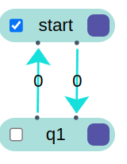
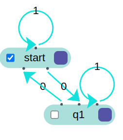
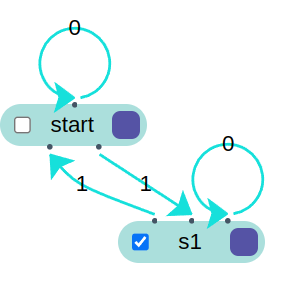
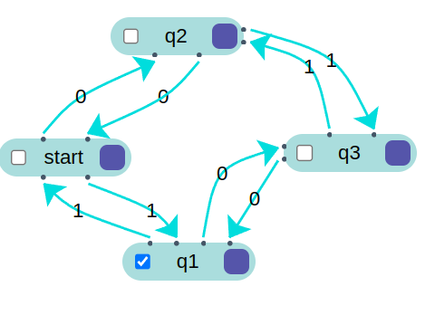
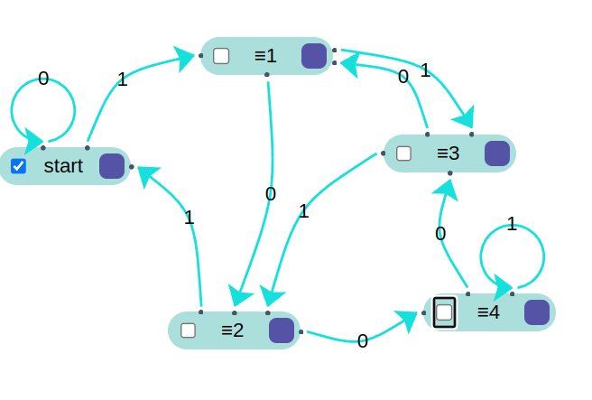

# Práctica 2 / Ejercicio 1  
## Construir autómatas finitos para los siguientes lenguajes:  
### I. Cadenas sobre Σ = {0} de longitud par.  

### II. Cadenas sobre Σ = {0, 1} con cantidad par de ceros.  
  
### III. Cadenas sobre Σ = {0, 1} con cantidad impar de unos.  
  
### IV. Cadenas sobre Σ = {0, 1} con cantidad par de ceros y cantidad impar de unos.  
  
### V. Cadenas sobre Σ = {0, 1} que, interpretadas como un número binario, sean congruentes a cero módulo 5.  
  
Sea un número $x$ escrito en binario.  
Agregar un 0 al final del número $\to$ duplica a $x$.  
Agregar un 1 al final del número $\to$ duplica a $x$ y le suma $1$.  

Lo voy a analizar para cada congruencia $\pmod{5}$:  
$x \equiv 0 \pmod{5}$ \
$\rightarrow_0 \quad 2x \equiv 0 \pmod{5} \checkmark$ \
$\rightarrow_1 \quad 2x + 1 \equiv 1 \pmod{5}$

$x \equiv 1 \pmod{5}$ \
$\rightarrow_0 \quad 2x \equiv 2 \pmod{5}$ \
$\rightarrow_1 \quad 2x + 1  \equiv 3 \pmod{5}$

$x \equiv 2 \pmod{5}$ \
$\rightarrow_0 \quad 2x \equiv 4 \pmod{5}$ \
$\rightarrow_1 \quad 2x + 1 \equiv 0 \pmod{5} \checkmark$

$x \equiv 3 \pmod{5}$ \
$\rightarrow_0 \quad 2x \equiv 1 \pmod{5}$ \
$\rightarrow_1 \quad 2x + 1 \equiv 2 \pmod{5}$

$x \equiv 4 \pmod{5}$ \
$\rightarrow_0 \quad 2x \equiv 3 \pmod{5}$ \
$\rightarrow_1 \quad 2x + 1 \equiv 4 \pmod{5}$  

