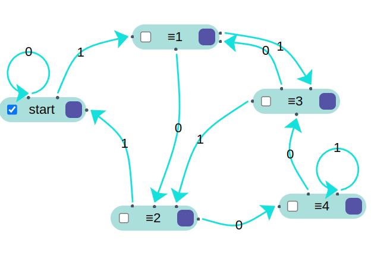

# Práctica 2 / Ejercicio 1  
## Construir autómatas finitos para los siguientes lenguajes:  
### I. Cadenas sobre Σ = {0} de longitud par.  

### II. Cadenas sobre Σ = {0, 1} con cantidad par de ceros.  

### III. Cadenas sobre Σ = {0, 1} con cantidad impar de unos.  

### IV. Cadenas sobre Σ = {0, 1} con cantidad par de ceros y cantidad impar de unos.  
Pensar en que existen 4 estados y observar como pasar de uno al otro:  
Sea $q(x,y)$, donde x indica la paridad de 0 e y la paridad de 1.  
1. $q(P,P)$  
2. $q(P,I) \to$ estado de salida.  
3. $q(I,P)$  
4. $q(I,I)$  
Entonces...  

| δ  | 0   | 1  |
|:----- |:-----:| -----:|
| start    | q2 | q1  |
| q1    | q3 | start  |
| q2    | start | q3  |
| q3    | q1 | q2  |

### V. Cadenas sobre Σ = {0, 1} que, interpretadas como un número binario, sean congruentes a cero módulo 5.  

| δ  | 0   | 1  |
|:----- |:-----:| -----:|
| start    | start | ≡1  |
| ≡1    | ≡2 | ≡3  |
| ≡2    | ≡4 | start |
| ≡3    | ≡1 | ≡2 |
| ≡4    | ≡3 | ≡4 |

Sea un número $x$ escrito en binario.  
Agregar un 0 al final del número $\to$ duplica a $x$.  
Agregar un 1 al final del número $\to$ duplica a $x$ y le suma $1$.  

Lo voy a analizar para cada congruencia $\pmod{5}$:  
$x \equiv 0 \pmod{5}$ \
$\rightarrow_0 \quad 2x \equiv 0 \pmod{5} \checkmark$ \
$\rightarrow_1 \quad 2x + 1 \equiv 1 \pmod{5}$

$x \equiv 1 \pmod{5}$ \
$\rightarrow_0 \quad 2x \equiv 2 \pmod{5}$ \
$\rightarrow_1 \quad 2x + 1  \equiv 3 \pmod{5}$

$x \equiv 2 \pmod{5}$ \
$\rightarrow_0 \quad 2x \equiv 4 \pmod{5}$ \
$\rightarrow_1 \quad 2x + 1 \equiv 0 \pmod{5} \checkmark$

$x \equiv 3 \pmod{5}$ \
$\rightarrow_0 \quad 2x \equiv 1 \pmod{5}$ \
$\rightarrow_1 \quad 2x + 1 \equiv 2 \pmod{5}$

$x \equiv 4 \pmod{5}$ \
$\rightarrow_0 \quad 2x \equiv 3 \pmod{5}$ \
$\rightarrow_1 \quad 2x + 1 \equiv 4 \pmod{5}$  

