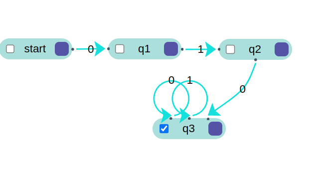
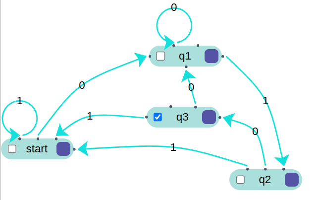

# Práctica 2 / Ejercicio 2   
## Construir autómatas finitos para los siguientes lenguajes sobre Σ = {0, 1}:   
### I. Cadenas que comiencen con 010.  

### II. Cadenas que terminen con 010.  

### III. Cadenas que contengan la subcadena 000.  

### IV. Cadenas que no contengan la subcadena 000.  

### V. Cadenas que contengan la subcadena 000 exactamente una vez (no la 000).  

### VI. Cadenas que no contengan la subcadena 000 ni la 010.  
