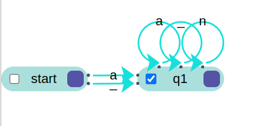

# Práctica 2 / Ejercicio 3    
## Construir autómatas finitos para los siguientes lenguajes:   
### I. Identificadores de cualquier longitud que comiencen con una letra o guión y contengan letras, dígitos o guiones.  
Sean:
1. "a" cualquier letra.
2. "_" cualquier guión.
3. "n" cualquier dígito.

