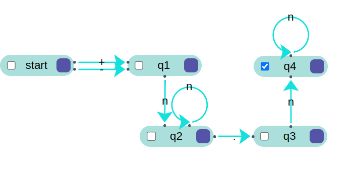

# Práctica 2 / Ejercicio 3    
## Construir autómatas finitos para los siguientes lenguajes:   
### I. Identificadores de cualquier longitud que comiencen con una letra o guión y contengan letras, dígitos o guiones.  
Sean:
1. "a" cualquier letra.
2. "_" cualquier guión.
3. "n" cualquier dígito.

### II. Constantes enteras con signo.  
  

### III. Constantes enteras con signo opcional.  
  

### IV. Constantes reales con signo.  
Ejemplos: `+123.456, -55.0, +00.430`  
  

### V. Constantes reales con signo opcional y partes enteras y fraccionarias opcionales.   
Ejemplos:  `los anteriores más 123.456, -55., +.43`     
   

### VI. Constantes reales con notación exponencial opcional.  
Ejemplos: `los anteriores más -55.E5, +.43E-6`   
   

