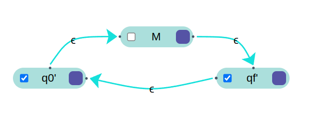

# Práctica 2 / Ejercicio 4  
Dado un autómata finito $\mathscr{L}$, indicar cómo construir autómatas finitos para los siguientes lenguajes. Indicar en cada caso si es necesario que el autómata de entrada sea determinístico o no, y de qué tipo es el autómata resultante.  
## I. 
$\mathscr{L}^c$, el complemento de $\mathscr{L}$.  
```
Dado un AFD M=<Q,Σ,δ,q0,F> nos aseguramos que esté completo (agregamos estados trampa si los necesita)
y armamos otro AFD M'=<Q,Σ,δ,q0,F'> donde F'=Q\F.
Es decir, invertimos los estados, consiguiendo el complemento de L.
```
## II.  
$\mathscr{L}^{*}$, la clausura de Kleene de $\mathscr{L}$.  
```
Dado un AFD M=<Q,Σ,δ,q0,F> construimos un AFND-λ M'=<Q',Σ,δ',q0',F'>
Donde:
* Q' = Q U {q0',qf'}
* F' = {qf'}
* δ' : Q' x (Σ U {λ}) -> P(Q') donde:
  * δ'(q0', λ) = {q0,q0'} 
  * δ'(qf, λ) = {qf'}
  * δ'(q,a) = δ(q,a) si q pertenece a los Q de M y a pertenece al alfabeto Σ.
* q0' es un estado inicial nuevo que se conecta al q0 de M con la transición λ.
* qf' es un estado final que se conecta a todo estado final de M con una transición λ.
* qf' tambien es conecta al estado inicial q0' con una transición λ para poder repetir el proceso.
* En relación a F', los estados finales de M ya no son finales en M'

No importa el determinismo de M.
```
  
## III.  
$\mathscr{L}^{r}$, la reversa de $\mathscr{L}$.  
```
```
